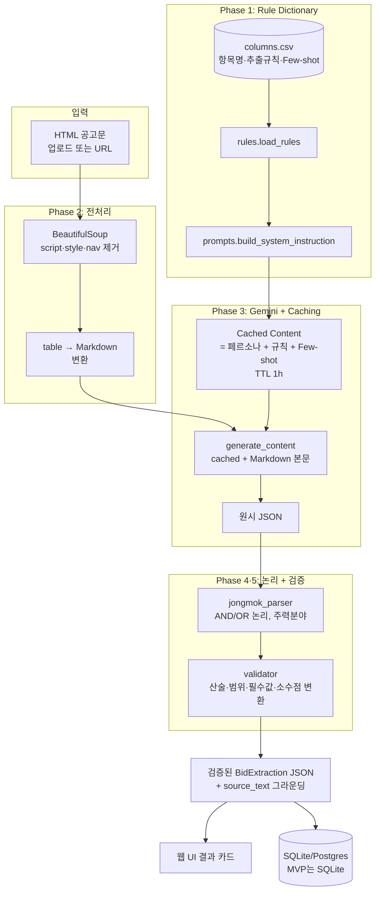

# AI 입찰 공고 분석 시스템 개발 기획서 (Ver 1.0)

## 1. 추진 배경 및 목적

| 항목 | 내용 |
|---|---|
| 배경 | 나라장터·공공기관에서 발행되는 입찰 공고문은 비정형 HTML 또는 PDF로 제공되어, 관심 있는 입찰 건의 핵심 정보(기초금액, 투찰율, 참가자격, 일정 등)를 사람이 일일이 읽고 옮겨 적는 비효율이 존재한다. |
| 목적 | LLM(Google Gemini) 기반으로 공고문에서 표준 항목을 자동 추출·검증하여 사내 입찰 관리 DB에 적재 가능한 구조화 JSON으로 변환한다. |
| 핵심 KPI | 추출 정확도 95% 이상, 일 1,000건 이상 처리 효율, 항목 추가/규칙 변경 시 코드 수정 없이 대응 가능한 구조. |

## 2. 시스템 개요

본 시스템은 단순한 LLM 호출이 아니라 **규칙 정의 → 데이터 정제 → AI 추출 → 데이터 검증** 파이프라인으로 구성된다.



## 3. 기능 요구사항

### v1.0 (현 릴리즈)
- HTML/PDF/TXT 공고문 업로드 또는 URL 입력
- 49개 표준 항목 자동 추출 (`data/columns.csv` 정의)
- 종목(입찰참가자격) AND/OR 논리 자동 정규화
- 후처리 검증 (산술·범위·타입·필수값·Source Grounding)
- 분석 결과 SQLite 저장 + 웹 UI 표시

### v1.1 이후 (로드맵)
- 자격 적합성 점수 (회사 프로필 ↔ 공고 매칭)
- 리스크 조항 분석 (지체상금, 하자보수, IP)
- 임베딩 기반 유사 공고 검색
- 나라장터 G2B Open API 자동 수집 + 배치 워커(일 1,000건+)
- HWP/HWPX 입력
- 운영용 RDB(Postgres) 마이그레이션

## 4. 추출 대상 표준 필드

`data/columns.csv` 에서 외부 관리하며, 새 항목 추가 시 코드 수정 없이 캐시가 자동 재생성된다(규칙 SHA-256 해시 기반).

핵심 카테고리:

| 카테고리 | 주요 키 |
|---|---|
| 식별 | 발주처코드, 상위_발주처코드, 공고확인 |
| 사업 정보 | 공사현장, 검색용현장, 입찰방식, 계약체결방식 |
| 금액 | 기초금액, 추정가격, 예가_상한, 예가_하한, 평가기준금액, 보험료합계, 금액정보 |
| 일정 | 현설일, 등록마감일, 협정마감일, 투찰시작일, 투찰마감일, 입찰일, 입력일 |
| 참가자격 | 종목, 참가자격, 지역, 지역의무비율, 최소참여비율, 협정업체수, 종목_모두보유, 대표사_최소비율 |
| 평가 | 적격발주처, 원발주처, 적격평가기준_세부, 난이도계수, 순공사입찰점수, 등급공사 |
| 기타 | 상호진출여부, 전문건설_주력분야, 일반_기타_전문, 공고상태, 기초금액발표전, ai컬럼 |

전체 정의는 `data/columns.csv` 참고.

### 출력 JSON 예시

```json
{
  "extracted": {
    "종목": [["포장공사업", "토목공사업"], ["종합건설업"]],
    "지역": ["서울특별시"],
    "기초금액": 3922300000,
    "투찰율": 0.87745,
    "지역의무비율": 0.49,
    "상호진출여부": 1,
    "투찰마감일": "2026-05-22T17:00",
    "보험료합계": {"국민연금": 51461963, "국민건강": 38948581}
  },
  "source": {
    "종목": "4. 입찰참가자격: 지반조성·포장공사업(주력분야: 포장공사업) 및 토목공사업 ...",
    "투찰율": "낙찰하한율: 87.745%"
  },
  "issues": []
}
```

## 5. 기술 스택

| 영역 | 선택 |
|---|---|
| 언어 | Python 3.11+ |
| 웹 프레임워크 | FastAPI + Uvicorn |
| LLM | Google Gemini 1.5 Flash (`gemini-1.5-flash-002`) — Context Caching 지원 |
| LLM SDK | `google-genai` |
| HTML 파싱 | BeautifulSoup4 + lxml |
| PDF 파싱 | pypdf |
| 데이터 검증 | Pydantic v2 |
| 저장 | SQLite (MVP), Postgres (v1.1+) |
| UI | Jinja2 템플릿 + 바닐라 JavaScript (의존성 없음) |
| 테스트 | pytest |

## 6. 비기능 요구사항

| 항목 | 기준 |
|---|---|
| 응답 시간 | 단일 공고 30초 이내 |
| 파일 크기 | 10MB 이하 |
| 비용 | Context Caching으로 시스템 토큰 80% 이상 절감(`cached_content_token_count` 로깅으로 검증) |
| 보안 | API 키는 환경변수, `.env` 는 `.gitignore` 처리 |
| 관측 | 매 호출 `usage_metadata` 로깅 (입력/캐시/출력 토큰) |

## 7. 5단계 구현 가이드

### Phase 1 — Rule Dictionary 구축
- `data/columns.csv` 에 모든 추출 규칙 정의
- `app/rules.py::load_rules()` 가 CSV → `Rule` dataclass 리스트로 변환
- `app/prompts.py::build_system_instruction()` 가 Rule 리스트를 받아 시스템 지침을 동적 합성
- **Junior Tip**: 프롬프트에 규칙을 하드코딩하지 말 것. 규칙 변경 시 CSV만 수정하면 다음 호출에서 캐시가 자동 갱신됨(SHA-256 해시 기반).

### Phase 2 — HTML → Markdown 전처리
- `app/preprocess.py::html_to_markdown()`
- `<script>`, `<style>`, `<nav>`, `<header>`, `<footer>`, `<noscript>`, `<iframe>` 제거
- 모든 `<table>` 을 Markdown 테이블로 변환 (colspan/rowspan 평면화)
- 빈 줄 정리

### Phase 3 — Gemini Engine + Context Caching
- `app/gemini_client.py::extract()`
- 규칙 해시 기반으로 캐시 재사용 — TTL 1시간
- `response_mime_type="application/json"` 강제
- 매 호출 `usage_metadata.cached_content_token_count` 로깅

### Phase 4 — 종목 AND/OR 논리 엔진
- `app/jongmok_parser.py::normalize_jongmok()`
- 처리 우선순위: OR 분리 → AND 분리 → 항목 정규화(주력분야 추출, 법령 부기 제거, 어미 제거)
- 괄호 내부의 `또는`/`및` 은 분리하지 않음 (보호)

### Phase 5 — 후처리 검증 + Source Grounding
- `app/validator.py::validate()`
- 타입 강제 변환 (int/float/bool/list/nested_list/date)
- 검증 룰 ID 분기 (`ratio_0_1`, `positive_int`, `zero_or_one`, `iso_datetime`, `iso_date`, `enum_*`)
- 산술 검증 (순공사원가 = 재료비 + 노무비 + 경비)
- Source Grounding: 모든 추출 항목에 `source` 객체의 동일 키가 있는지 확인, 없으면 `missing_source` 이슈

## 8. 주니어 개발자 체크리스트

- [ ] `data/columns.csv` 모든 항목의 `description` 이 한 문장으로 명확한가?
- [ ] HTML → Markdown 후 모든 `<table>` 이 `|---|` 구조로 보이는가?
- [ ] Gemini 호출 응답 로그에 `cached_content_token_count > 0` 인가?
- [ ] `종목` 파서가 법령 문구(`건설산업기본법…`) 를 모두 제거하는가?
- [ ] `지역의무비율`, `투찰율` 등 % 값이 0~1 소수로 변환되는가?
- [ ] 모든 추출 항목에 `source_text` 가 존재하는가?
- [ ] `pytest -q` 결과 모든 테스트 통과 (LLM 미호출)?

## 9. 일정 (제안)

| 주차 | 작업 |
|---|---|
| W1 | Rule Dictionary 확정, 전처리 모듈 |
| W2 | Gemini 클라이언트 + Caching, 종목 파서 |
| W3 | 검증 모듈, 웹 UI, 통합 테스트 |
| W4 | 정확도 측정 (실제 공고 100건), 프롬프트 튜닝, 운영 배포 준비 |
